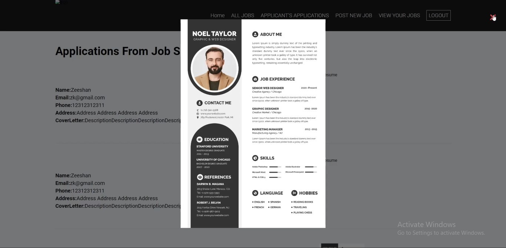

# JOB-HUNT: MERN Application


## Overview
JOB-HUNT is a modern job-searching platform built with the MERN stack (MongoDB, Express.js, React.js, and Node.js). It provides users with features such as creating accounts, searching for jobs, applying to job postings, and tracking applications. This project aims to simplify job hunting for candidates while allowing recruiters to post and manage job listings efficiently.
## Features

* User Features:

    - Account registration and login.
    - Browse job listings by category, location, and skill.
    - Save and apply for jobs.
    - Track application status.

* Recruiter Features:
    
    - Post job vacancies.
    - Manage job postings (edit or delete).
    - View applications for jobs.

* Admin Features:

    - User and recruiter management.
    - Moderate job posts.

* Other Features:

    - Responsive design for all devices.
    - User-friendly interface.
    - Secure authentication with JWT.
## Technologies Used

    - Frontend: React.js, Bootstrap 5, CSS
    - Backend: Node.js, Express.js
    - Database: MongoDB
    - Authentication: JSON Web Tokens (JWT)
    - Version Control: Git

## Installation and Setup

### 1. Clone the repository:
    ```bash
        `git clone https://github.com/yourusername/job-hunt-mern.git`
        
        `cd job-hunt-mern`

### 2. Install dependencies:
- For the backend:
            
                `cd backend`
                `npm install`

- For the frontend:
            
                `cd frontend`
                `npm install`

### 3. Configure environment variables:
- Create a `.env` file in the `backend` directory with the following:

    `MONGO_URI=your_mongodb_connection_string`
    `JWT_SECRET=your_jwt_secret`
    `PORT=5000`

### 4. Run the application:
- Start the backend:
    ```bash
        `cd backend`
        `npm run dev`

- Start the frontend:
    ```bash
        `cd frontend`
        `npm run dev`

### 5. Access the application at:
- Frontend: http://localhost:3000
- Backend API: http://localhost:5000/api


## Preview

<div align="center">
    
    
    
    
    
    
    
    
    
    
</div>